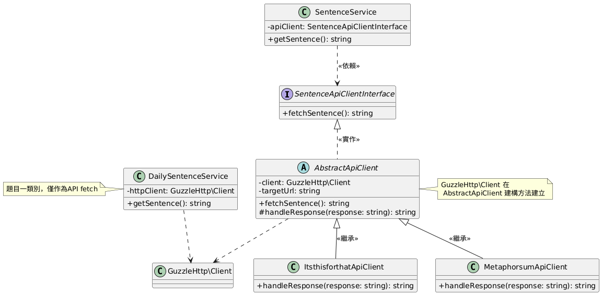

# RHINOSHIELD_Exam

此專案使用 Docker Compose 來建立 PHP 開發環境，並且預先安裝了 Composer 和 PHPUnit。

## 需求
- Docker：請確認您的系統已安裝並啟動 Docker。
- Docker Compose：此設置使用 Docker Compose 版本 3.8。

## 設定與安裝
1. clone repository
將專案複製到本地環境：
```bash
git clone https://github.com/kai890707/RHINOSHIELD_Exam.git
cd RHINOSHIELD_Exam
```
2. 建構並啟動容器
使用以下指令構建並啟動容器：
```bash
docker-compose up --build
```
此命令將會：
- 基於 php:8.2-cli 構建 Docker 映像。
- 安裝系統所需的依賴，如 git、zip 和 libzip-dev。
- 安裝 zip PHP 擴展。
- 全域安裝 Composer。
- 全域安裝 PHPUnit。
- 啟用主機 8081 port，並映射到容器的 8080 port，因此可透過 `http://localhost:8081/` 進行瀏覽
3. 運行 Composer
當容器啟動並運行後，您可以在容器內運行 Composer 指令。
安裝專案的依賴：
```bash
docker-compose exec php composer install
```
4. 運行 PHPUnit 測試
您可以在容器內執行以下指令來運行 PHPUnit 測試：
```bash
docker-compose exec php phpunit
```
5. 停止容器
若要停止容器，請執行：
```bash
docker-compose down
```

## 專案路徑
1. 起始點
位於`app/public/index.php`，該檔案為類別使用的主要描述
2. 主要邏輯
位於`app/src/Service/Exam_one`
3. 測試
位於`app/testing`

## UML 


### 類別與介面說明
- `DailySentenceService`
為題目一作答，實現特定的 `API fetch` 。

- `SentenceApiClientInterface`
為一介面，定義了需要實作的方法，確保所有實作這個介面的類別都具有一致的行為，作為依賴控制參照。

- `AbstractApiClient`
為一抽象類別，實作 `SentenceApiClientInterface`，並提供一個模板來讓子類別實作特定細節。設計遵循開放封閉原則（OCP），既可以擴展新的功能而無需修改基礎類別邏輯，又能夠提供模板方法來強制子類別實作某些行為，保持程式碼結構的一致性和可擴展性。
`fetchSentence` 方法作為主要的HTTP行為發送與Exception判斷，封裝了通用邏輯，如 API 請求或基礎操作，讓子類別可以專注於實作與其相關的具體邏輯。。
且定義了抽象方法 `handleResponse`，以便子類別實作其特定的回應處理邏輯，例如 JSON Format 或業務處理，避免在所有具體實作中重複大量程式碼。

- `MetaphorsumApiClient` 與 `ItsthisforthatApiClient`
這些類別都繼承了 `AbstractApiClient` ，並專注於特定的功能實現，例如 API 響應的處理等。

- `SentenceService`
接收 `SentenceApiClientInterface` 的具體實現（例如 `MetaphorsumApiClient` 與 `ItsthisforthatApiClient`）作為建構方法參數，實現了依賴注入，增強了類別的靈活性和可測試性。
且 `SentenceService` 不依賴於具體的 `ApiClient` 實現，而是依賴於 `SentenceApiClientInterface`，符合依賴反轉原則。

## 檔案運行
- 若欲執行`DailySentence`類別，請執行`index.php`
```bash
docker-compose exec php php app/public/index.php
```
亦可於瀏覽器搜尋
```
http://localhost:8081/
or 
http://localhost:8081/index.php
```

- 題目一進階題為`SentenceService`類別，若欲執行題目一進階題，請執行`sentenceService.php`
```bash
docker-compose exec php php app/public/sentenceService.php
```
亦可於瀏覽器搜尋
```
http://localhost:8081/sentenceService.php
```

## 測試運行
- 若欲執行測試相關類別，請執行
```bash
docker-compose exec php app/vendor/bin/phpunit  app/tests/{filename}
```
例如執行`AbstractApiClientTest.php`測試，則執行
```bash
docker-compose exec php app/vendor/bin/phpunit  app/tests/AbstractApiClientTest.php
```

## 注意事項
`docker-compose.yml` 設定將當前目錄 (.) 掛載到容器內的 `/var/www/html` 路徑，請確保您的專案文件位於正確的目錄中。